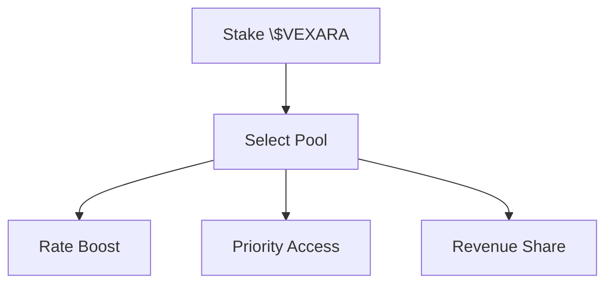

## Overview

The \$VEXARA token is the core economic unit of the VEXARA ecosystem, enabling users to buy, sell, and deploy tokenized AI Agents while participating in platform governance and earning rewards.

---

## Utilities

- Governance voting for protocol parameters and roadmap priorities
- Staking for API rate limit boosts and priority queue access
- Fee discounts on analytics and data exports
- Revenue share from enterprise data products (staking pool)
- Access to premium ML models and real-time features

---

## Distribution

| Allocation | Percentage | Cliff | Vesting |
|------------|-----------:|------:|--------:|
| Community & Ecosystem | 35% | 6 months | 36 months linear |
| Team & Advisors | 20% | 12 months | 36 months linear |
| Investors | 20% | 6 months | 24 months linear |
| Treasury | 15% | 0 | Discretionary |
| Liquidity | 5% | 0 | Immediate |
| Market Making | 5% | 0 | As needed |

---

## Emissions

Fixed supply: 1,000,000,000 \$VEXARA  
No inflation. Buyback-and-make mechanism funded by revenue.

---

## Staking Model

### Tiers

| Tier | Min Stake | Rate Limit Boost | Revenue Share |
|------|----------:|-----------------:|--------------:|
| Bronze | 1,000 | 1.2x | 0.5% |
| Silver | 25,000 | 1.5x | 1.5% |
| Gold | 100,000 | 2.0x | 3.0% |
| Platinum | 500,000 | 3.0x | 6.0% |

---

## Governance

- On-chain voting using SPL governance framework
- Proposal threshold: 0.25% of circulating supply
- Quorum: 8% of circulating supply
- Voting period: 5 days
- Execution delay: 48 hours

---

## Treasury Policy

- 30% of net revenue allocated to token buybacks
- Buybacks executed via TWAP across leading DEXs
- 50% of bought-back tokens are burned, 50% allocated to staking rewards
- Transparent monthly reporting with on-chain proofs

<Info>
Token design prioritizes long-term sustainability and alignment between platform usage and token value accrual.
</Info>
